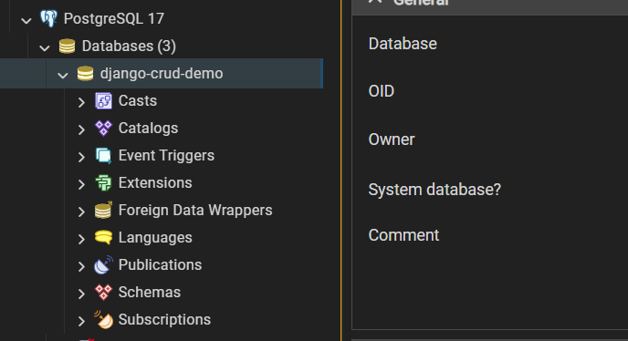

# Django CRUD `demo`

The project demonstrates a simple **CRUD** application built with Django.


## Features

- **Custom User Model** 
> Extend the default user model using `AbstractUser` to add fields like bio or profile picture while retaining authentication features.

- **CRUD Operations**
> Manage resources with full Create, Read, Update, and Delete functionality.

- **PostgreSQL**
> Use PostgreSQL as the database backend.

- **Responsive UI**
> Create a responsive user interface with Bootstrap CDI.

## Installation
It is recommended to have latest version of the following installed in your machine:

- [Python](https://python.org/downloads)
- [Django 5.1](https://docs.djangoproject.com/en/5.1/)
- [PostgreSQL](https://www.postgresql.org/download/)
- [Git](https://git-scm.com/downloads)
- [pgAdmin](https://www.pgadmin.org/download/)

## Local Installation

### Clone the repository

   ```bash
   git clone https://github.com/mkeithX/django-crud-demo.git
   ```
   ```bash
   cd django-crud-demo
   ```

### Create a virtual environment and install dependencies

   ```bash
   py -m venv .venv
   ```
   ```bash
   py -m pip install --upgrade -r requirements.txt
   ```
### Configure environment variables in the `.env` 

```bash
cp .env.example .env
```

<pre>
SECRET_KEY=
ALLOWED_HOSTS_IN_DEV=
STATICFILES_DIRS=

# Database Cofig
DB_NAME=
DB_HOST=
DB_PORT=
DB_USER=
DB_PASS=
DB_TEST=
DB_SSL=
</pre>

### PostgreSQL database
You can use the pgAdmin to setup database




### Run migrations to set up the database

   ```bash
   py manage.py migrate
   ```

### Create a superuser

   ```bash
   py manage.py createsuperuser
   ```

### Run the development server

   ```bash
   py manage.py runserver
   ```

Open [http://127.0.0.1:8000/](http://127.0.0.1:8000/) in your web browser to view the application.


## IMPORTANT

This project uses a custom user model defined in the accounts app. It’s important to configure the custom user model before running the initial migration. Ensure that the `AUTH_USER_MODEL` setting in `settings.py` is properly set:

```python
AUTH_USER_MODEL = 'apps_users.User'
```
## What's Next ?

This project includes custom commands that enhance its functionality and simplify tasks. Read the [docs](https://mkeithx.pages.dev/docs/repo/django-crud-demo) to learn more.


## License

See [License](./LICENSE).

## More cool stuff
More cool stuff in [**my website**](https://mkeithx.github.io).